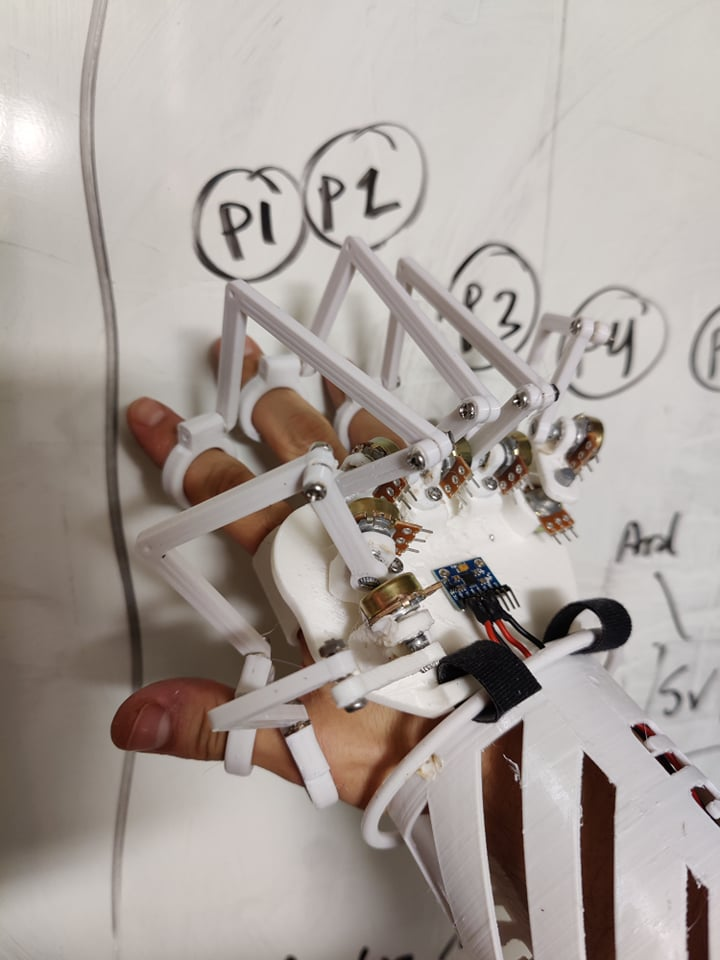
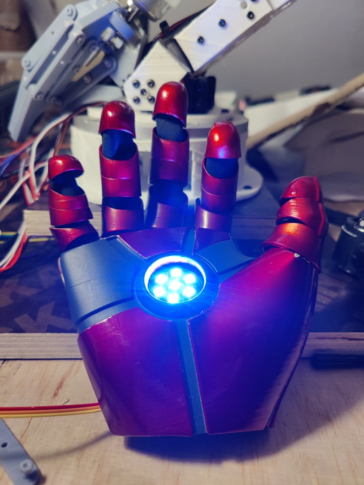
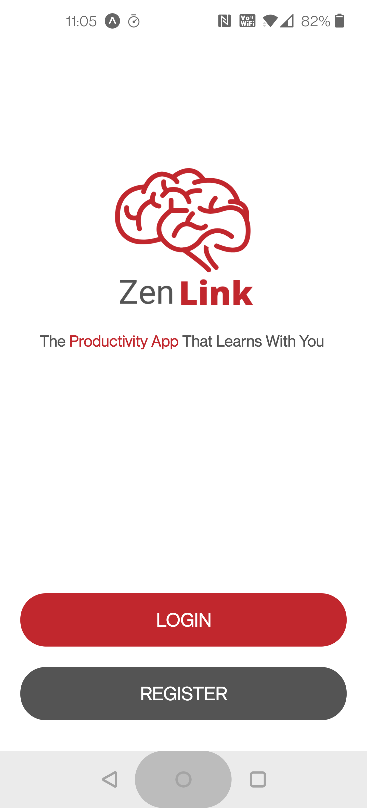
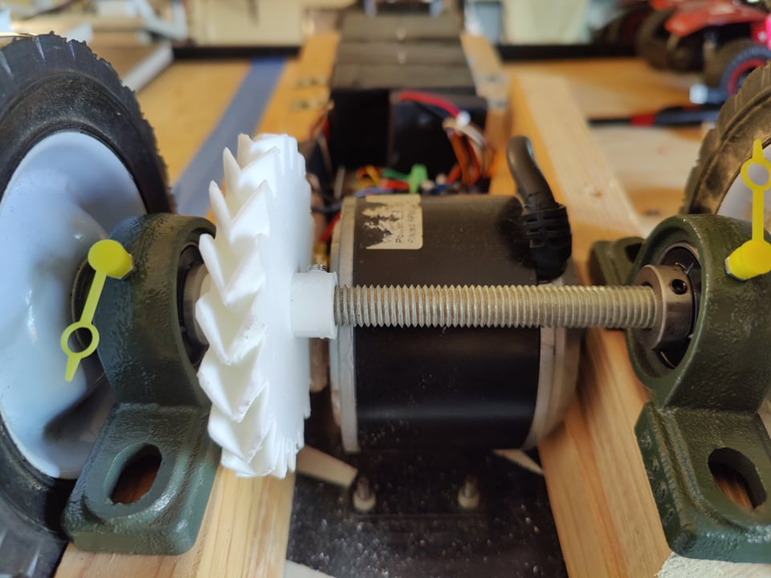

<!-- Main -->

<section id="two" class="spotlights">
	<section>
		
		

			

				<header class="major">
					<h3>Robotics!</h3>
				</header>
				
This gallery includes my original designs for 3D printed robotics. From a 3ft tall 6-Axis Robotic Arm with Gripper, 
					to a humanoid remote-controlled robotic arm (real time human arm controller),
					all the way to a Object Recognition-equipped rover.

				<ul class="actions">
					<li><a href="projects.html" class="button">Learn more</a></li>
				</ul>
			

		

	</section>
	<section>
		
		

			

				<header class="major">
					<h3>TensorFlow/Keras Projects</h3>
				</header>
				
Custom Keras models from scratch, Image Classification, Text Classification, NLP, Sequence-to-Sequence Models, 
					LSTM, Deep Neural Networks, Speech Recognition.

				<ul class="actions">
					<li><a href="projects.html" class="button">Learn more</a></li>
				</ul>
			

		

	</section>
	<section>
		
		

			

				<header class="major">
					<h3>3D Printing Expertise</h3>
				</header>
				
Click HERE to see PLA IRON MAN! Also... I assemble, maintain, and fix my machines. Have a totally dead Etsy store, 
					but in return, a gallery of interesting miniatures, cosplay, and mechanical prints.

				<ul class="actions">
					<li><a href="projects.html" class="button">Learn more</a></li>
				</ul>
			

		

	</section>
	<section>
		
		

			

				<header class="major">
					<h3>App Dev (Android)</h3>
				</header>
				
App development with React Native and Python. Coming Soon!

				<ul class="actions">
					<li><a href="projects.html" class="button">Learn more</a></li>
				</ul>
			

		

	</section>
	<section>
	
	

		

			<header class="major">
				<h3>Electrical, IoT, and Other</h3>
			</header>
			
Electric bike! Electric skateboard! Home Gym Build!

			<ul class="actions">
				<li><a href="projects.html" class="button">Learn more</a></li>
			</ul>
		

	

</section>
</section>

